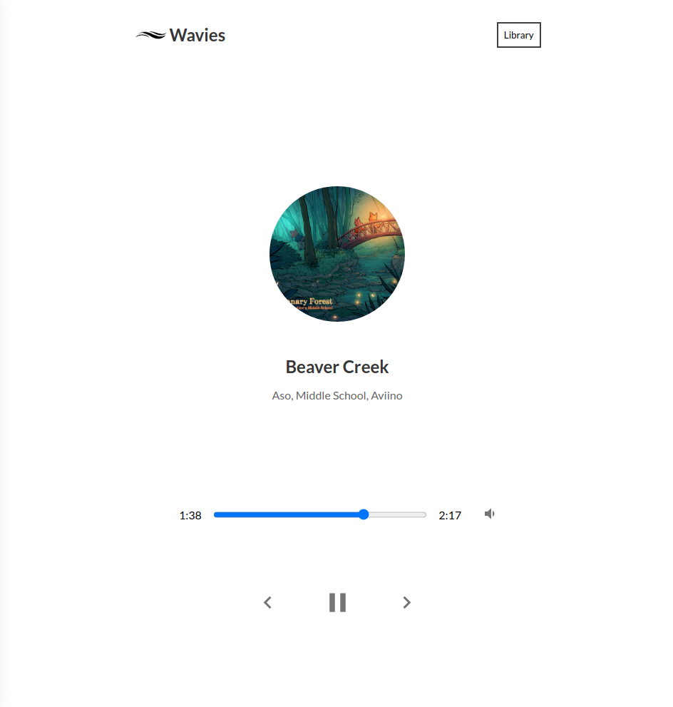

# :ocean: Wavies

Wavies is music app created with React :musical_note: 

## Technologies

* `ReactJS`
* `MaterialUI`
* `Hooks`
* `SCSS`

## Screenshots

## Project setup

`yarn start`

Runs the app in the development mode.\
Open [http://localhost:3000](http://localhost:3000) to view it in the browser.

The page will reload if you make edits.\
You will also see any lint errors in the console.
